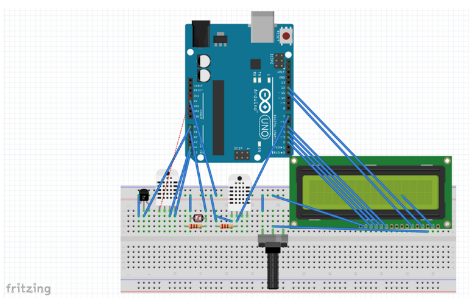

# Weather Station

For the final project of the 
Instrumentation and Measurement class of the 1st semester of 
Computer Engineering at Insper (Jun 2015), the students needed to build a small weather station. This station had to be monitored with an Arduino board, made with some sensors and an LCD. The sensors used in this project were LM35 (temperature), DHT11 (humidity), BMP180 (pressure), and LDR (luminosity). All of them were calibrated correctly, and these calibrations were taken into account when displayed the values on the LCD.

## Arduino Circuit

The Arduino circuit that was used in this project is represented on the schema down below:

### Prerequisites

For this project to work some libraries are needed. Those are:

* [DHT](https://www.arduinolibraries.info/libraries/dht-sensor-library)
* [Adafruit_BMP085](https://www.arduinolibraries.info/libraries/adafruit-bmp085-library)
* [Wire](https://www.arduino.cc/en/reference/wire) - 
This library allows you to communicate with I2C / TWI devices.
* [LiquidCrystal](https://playground.arduino.cc/Main/LiquidCrystal/)
